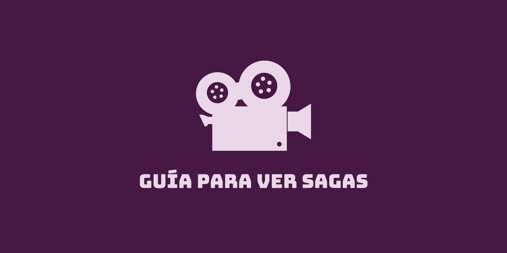

# Guía para ver sagas

***

# Índice

* ## Descripción del proyecto
* ## Paleta de colores
* ## Tipografías
* ## Participantes

 
 

## Descripción del proyecto

### Nuestro proyecto "Guía para ver sagas" fue pensado como un sitio web para acceder a información sobre diversas sagas cinematográficas. El objetivo principal del sitio es orientar a los usuarios que no hayan visto alguna de las sagas propuestas y deseen conocer datos sobre ellas, como por ejemplo el número de películas que las componen, la cronología, el orden de visualización, la sinopsis, los actores, los directores, etc. 
### El objetivo secundario del sitio es proporcionar esta misma información a cualquier otro usuario que desee visitarlo.
### El público destinatario de "Guía para ver sagas" es entre 15 a 50 años.

 
 

## Paleta de colores

### La paleta de colores que elegimos para nuestro sitio web es:
* ##  #340C30
* ##  #461843
* ##  #582455
* ##  #A94CA4
* ##  #EAD7E7

 
 

## Tipografías

### Las tipografías elegidas son:
* ### Lato
* ### Roboto
* ### Times New Romal
* ### Arial

 
 

## Participantes

### Formamos parte de este proyecto:
* ### Paula de los Hoyos
* ### Micael Maldonado Oriz
* ### Marisa Xiong
 
 
 
